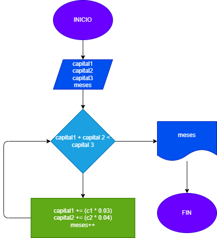

# Taller Estructuras Repetitivas de POO

## 1) Pedro tiene un capital de c1 pesos, y Juan uno de c2 pesos. Uniendo los dos no les alcanza para hacerun negocio que requiere una inversión de c3 pesos. Deciden colocar cada uno su capital a ganar interés. Pedro lo colocó a un interés compuesto del 3% mensual, y Juan al 4% mensual. Hacer el diagrama deflujo y el programa en Java que averigüe e imprima encuántos meses, uniendo los dos capitales, pueden hacer el negocio que desean.

## 2) Hacer el diagrama de flujo y el programa en Java que lea un número n, entero y positivo, y que le calcule su factorial y que lo imprima junto con el número leído.

## 3) Hacer el diagrama de flujo y el programa en Java que lea un número n, entero y positivo, y que determine si es o no un número primo.

## 4) Determinar si un número es capicúa o no. Se dice que un número capicúa es aquel que al invertir suscifras da el mismo número. Por ejemplo, 12321 invertido es 12321. Entonces es un número capicúa.
